# 🎵 Playlist Maker - приложение для прослушивания музыки
## 🎧 Медиатека
При запуске приложения открывается экран медиатека. В зависимости от наличия избранных треков отобразится плейсхолдер или список треков

  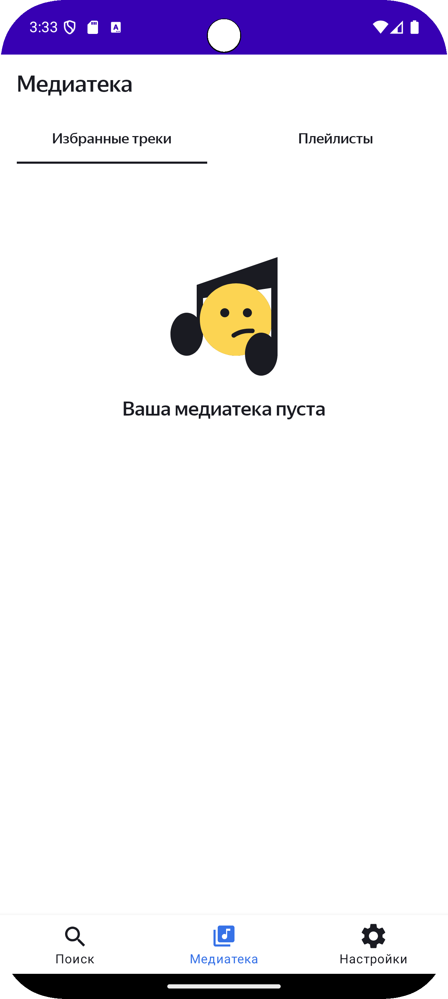
  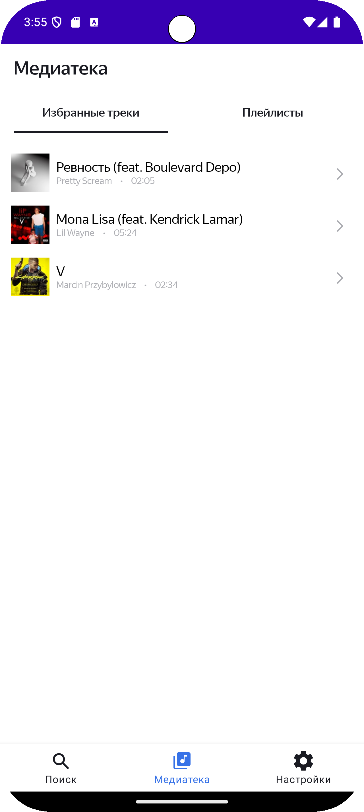
   
  <em>Рис. 1: Экран "Медиатека" избранные треки</em>

По свайпу вправо откроется вкладка с плейлистами. В зависимости от наличия плейлистов отобразится плейсхолдер или список плейлистов

  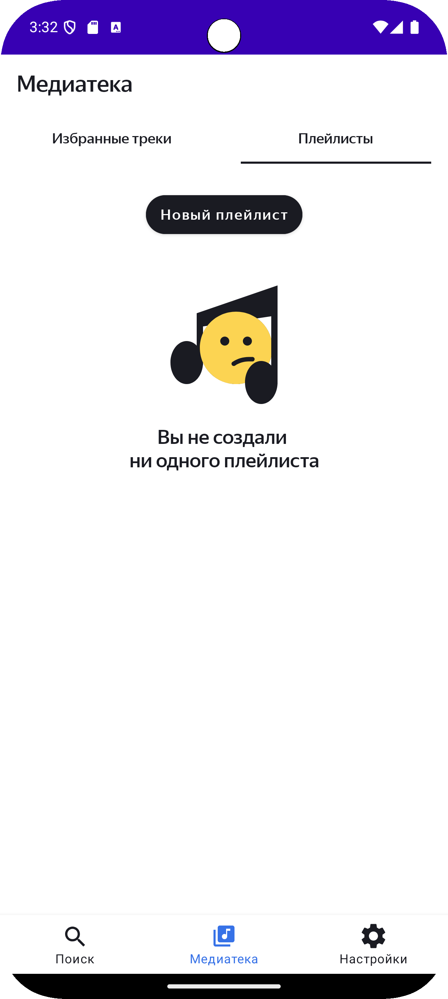
  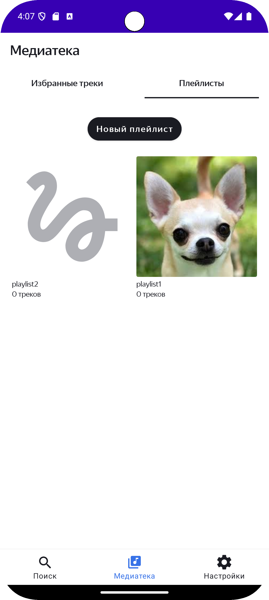
   
  <em>Рис. 2: Экран "Медиатека" плейлисты</em>

## 💽 Создание плейлиста
Чтобы создать плейлист необходимо нажать на кнопку "Создать плейлист", после чего откроется экран создания плейлиста

  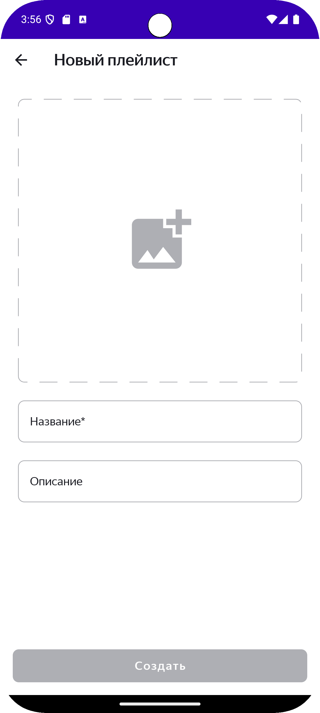
   
  <em>Рис. 3: Экран "Создать плейлист"</em>

Обложка плейлиста добавляется пользователем. Если обложка не добавлена, то на месте обложки будет плейсхолдер

  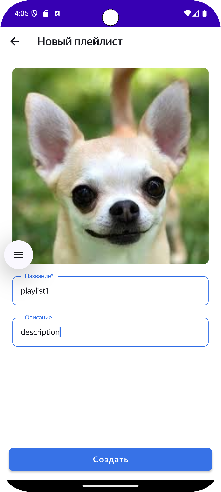
   
  <em>Рис. 4: Экран "Создать плейлист" </em>

Можно посмотреть детали плейлиста:
- Название плейлиста
- Описание плейлиста
- Дата создания плейлиста
- Список треков в плейлисте
- Количество треков в плелисте
- Длительность плейлиста

Кроме того, можно удалить плейлист, изменить или поделиться 

  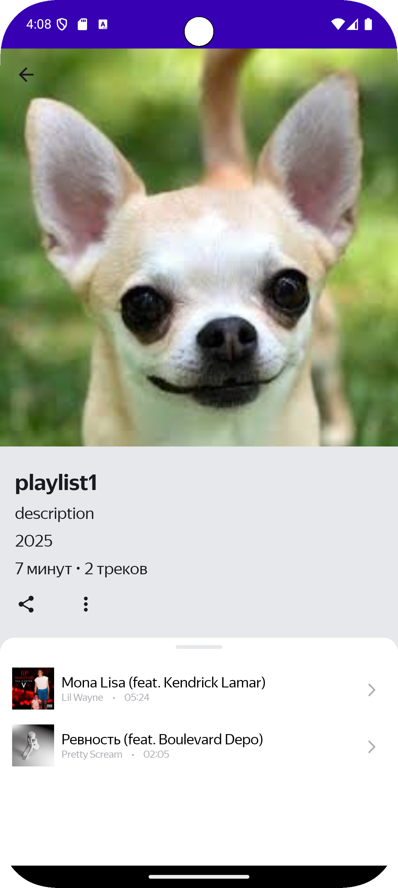
  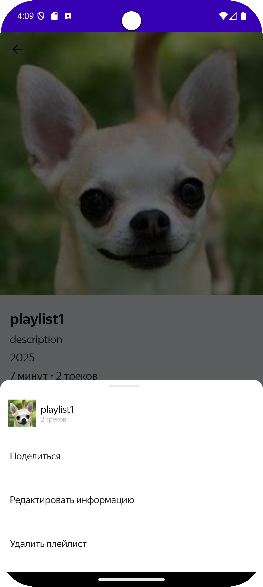
   
  <em>Рис. 5: Экран "Детали плейлиста" </em>

## ⚙️ Настройки
В настройках реализована функция переключения темы приложения

  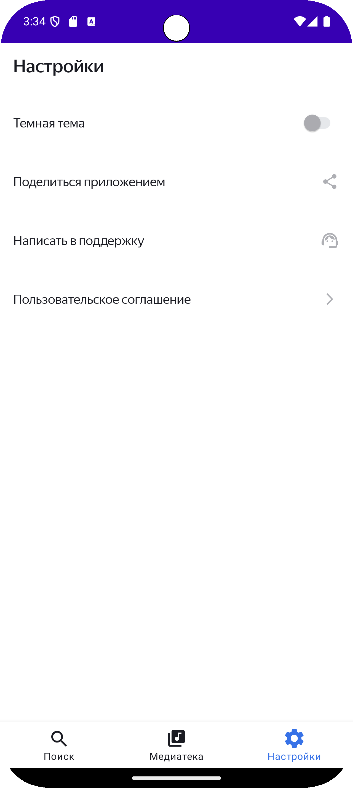
  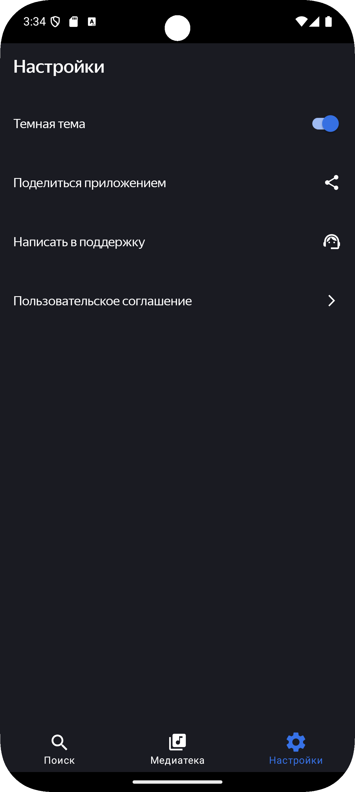
   
  <em>Рис. 6: Экран "Настройки"</em>

## 🔍 Поиск

  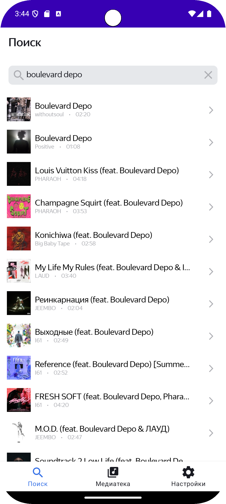
   
  <em>Рис. 7: Поиск треков</em>

При нажатии на элемент списка, открывается плеер, где реализованы функции:
- Прослушать трек
- Добавить трек в избранное
- Добавить трек в плейлист

  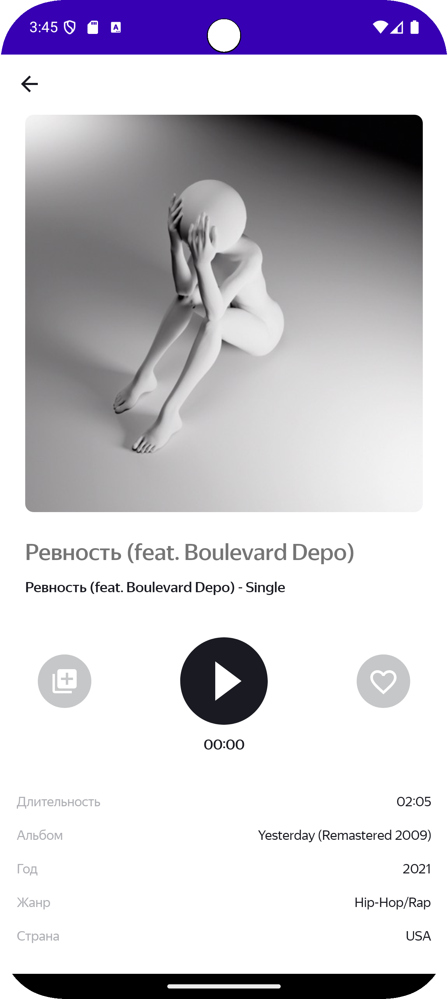
  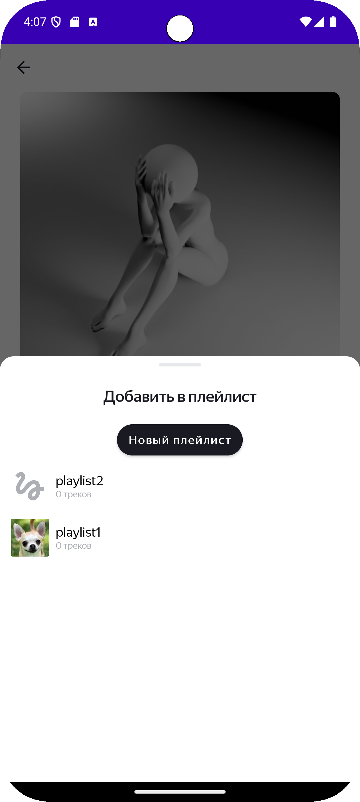
   
  <em>Рис. 8: Плеер </em>

При нажатии на кнопку "Очистить историю" история поиска удаляется

  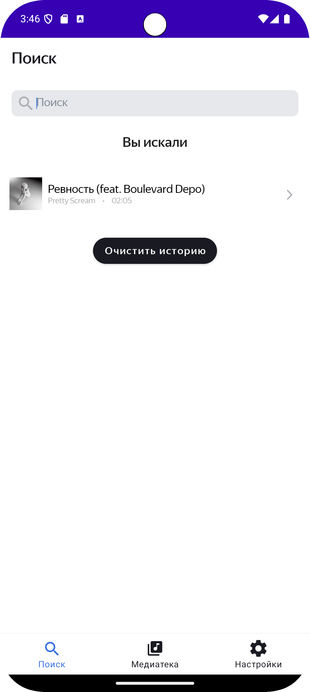
  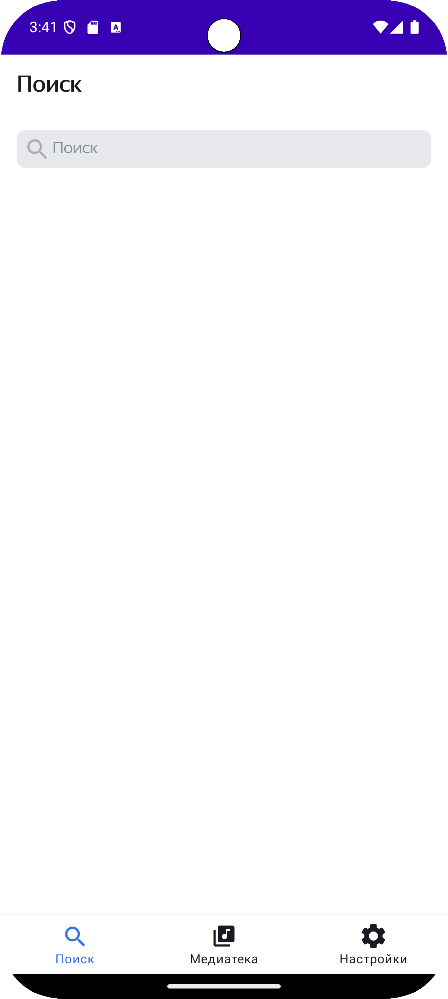
   
  <em>Рис. 9: Очистка истории</em>

## 🛠 Технологии
- Kotlin + Coroutines
- Retrofit и OkHttp
- Room 
- Flow и LiveData
- Koin
- MVVM
- AdapterDelegates
- Clean Architecture
- SharedPreferences

